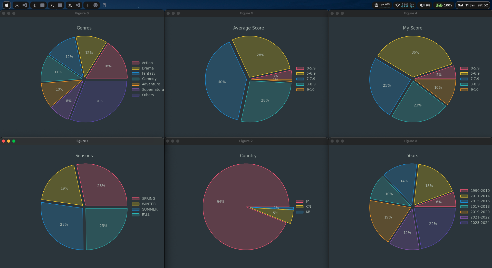

<div align="center">
  
</div>

<br>

<div align="center">

  [](https://github.com/marsdevx/anilist-visualizer/commits/main "Last Commit")
  [](https://github.com/marsdevx/anilist-visualizer "Languages")
  <br>
  [](https://github.com/marsdevx/anilist-visualizer/blob/main/imgs/preview.png "Graphs")
  [](https://docs.anilist.co "AniList API")
  [](https://github.com/marsdevx/anilist-visualizer/blob/main/imgs/preview.png "Data Visualization")
  [](https://github.com/marsdevx/anilist-visualizer/blob/main/LICENSE "License")

</div>

---

# ⛩️ AniList Visualizer

**AniList Visualizer** is an **open-source** **data visualization** tool designed to analyze and graphically represent anime statistics from your **AniList profile**. Built with **Python**, this project connects to the **AniList API** and transforms your profile data into **pie charts**.

*	Perfect for **anime** fans and **data enthusiasts** alike.
*	Powered by the data visualization library **matplotlib**
* Designed to transform your **AniList** data into meaningful and engaging **visuals**.
*	Includes 6 **graphs** showcasing completion rates by years, seasons, genres, and more

Discover trends in your anime-watching habits and gain unique insights into your AniList profile with this fun and interactive tool!

---

## 🖼️ Preview

<div align="center">
  
</div>

---

## 🛠️ Installation

To install this project, Launch the Terminal app on your system, and run the commands below. <br>
  - If a pop-up appears prompting you to download the Xcode Command Line Tools after the first command, click “Download” and then run the first command again.

1. **Clone repo**
```bash
git clone https://github.com/marsdevx/anilist-visualizer.git ~/Downloads/Anilist-Visualizer
```

2. **Install dependencies**
```bash
brew install python
pip3 install --break-system-packages matplotlib requests validators
```

---

## 🚀 Usage

Follow these steps to set up and run AniList Visualizer:

1. **Create Your AniList Client**  
- Go to [AniList Developer Settings](https://anilist.co/settings/developer).  
- Click **Create New Client**.  
- Fill in the **name** field (you can write anything) and leave the **redirect URL** blank.  
- Click **Save** and **copy the Client ID** (a series of five numbers under the "ID" field).

2. **Run the Program to Get the Authorization URL**  
Replace `<id>` with the Client ID you copied:
```bash
cd ~/Downloads/Anilist-Visualizer && python3 get_url.py <id>
```

3. **Authorize the Request**
- After running the previous command, you’ll be redirected to an authorization page.
- Click **Authorize**.
- Copy the **URL** from the address bar.

4. **Run the Main Program**  
Replace `<url>` with the URL you copied:
```bash
cd ~/Downloads/Anilist-Visualizer && python3 anilist_viz.py <url>
```

---

## 📋 License

All the code contained in this repo is licensed under the [MIT License](LICENSE)

```
MIT License

Copyright (c) 2025 marsdevx

Permission is hereby granted, free of charge, to any person obtaining a copy
of this software and associated documentation files (the "Software"), to deal
in the Software without restriction, including without limitation the rights
to use, copy, modify, merge, publish, distribute, sublicense, and/or sell
copies of the Software, and to permit persons to whom the Software is
furnished to do so, subject to the following conditions:

The above copyright notice and this permission notice shall be included in all
copies or substantial portions of the Software.

THE SOFTWARE IS PROVIDED "AS IS", WITHOUT WARRANTY OF ANY KIND, EXPRESS OR
IMPLIED, INCLUDING BUT NOT LIMITED TO THE WARRANTIES OF MERCHANTABILITY,
FITNESS FOR A PARTICULAR PURPOSE AND NONINFRINGEMENT. IN NO EVENT SHALL THE
AUTHORS OR COPYRIGHT HOLDERS BE LIABLE FOR ANY CLAIM, DAMAGES OR OTHER
LIABILITY, WHETHER IN AN ACTION OF CONTRACT, TORT OR OTHERWISE, ARISING FROM,
OUT OF OR IN CONNECTION WITH THE SOFTWARE OR THE USE OR OTHER DEALINGS IN THE
SOFTWARE.
```